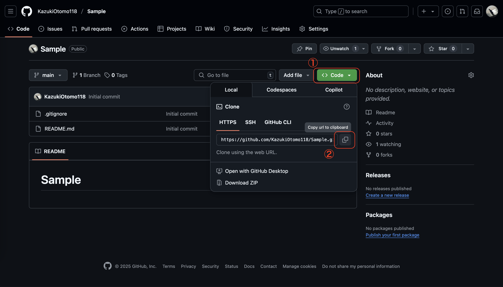
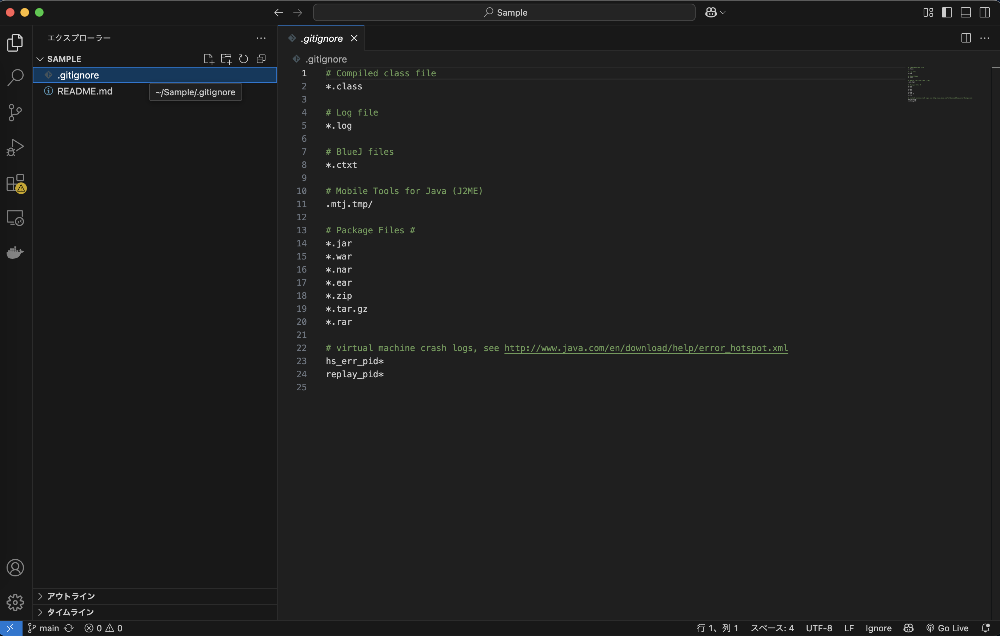
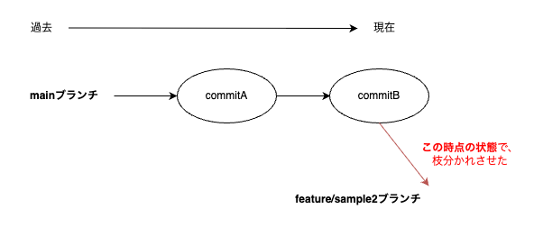
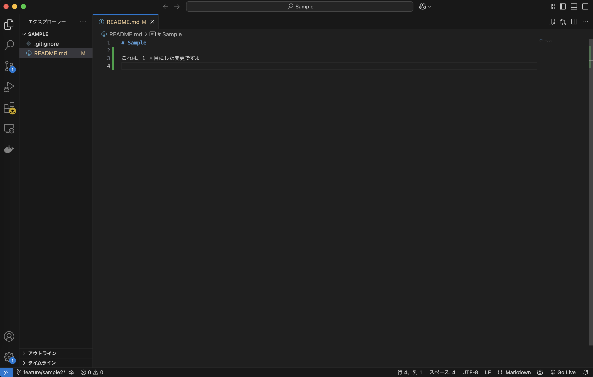
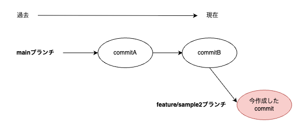
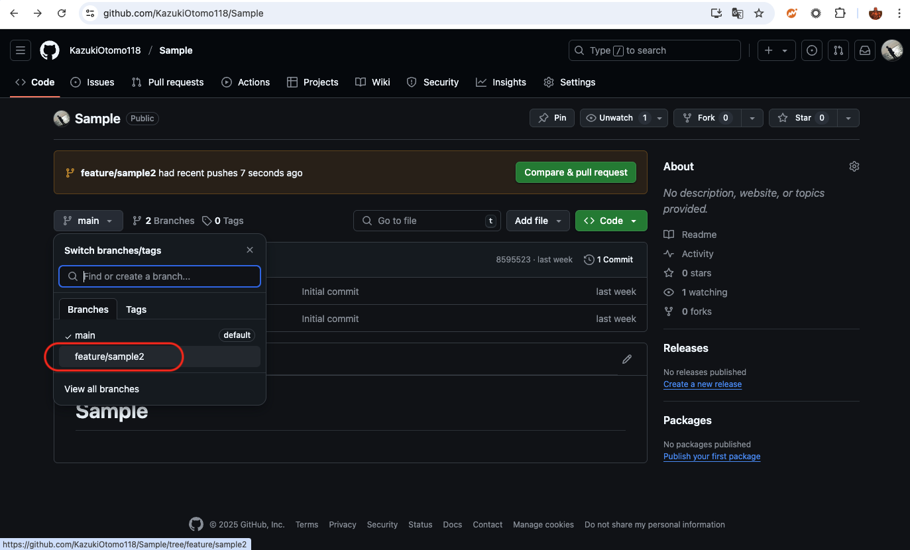
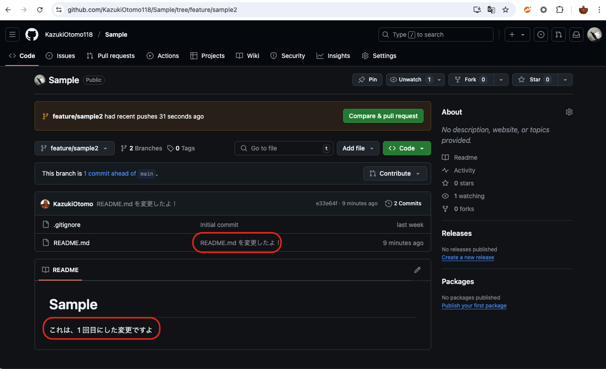
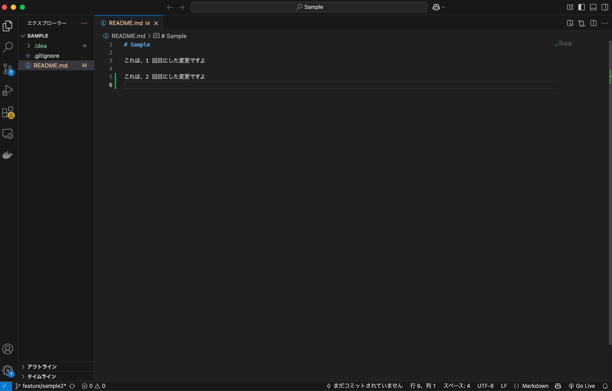
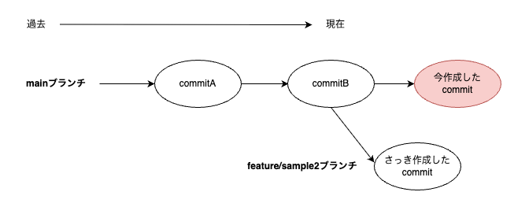

author: Kazuki Otomo
summary: Git&Github の使い方
id: github-starter
categories: codelab,markdown
environments: Web
status: Published
feedback link: https://github.com/KazukiOtomo

# 開発現場で困らないための Git & Github

## 案件に配属されました！開発環境を整えましょう！

### 1. **レポジトリの URI を取得する**

<aside class="negative">
アカウント作成やログインに関しては、Github Docs(https://docs.github.com/ja/get-started/start-your-journey/creating-an-account-on-github)を参考にしてください。
</aside>

<aside class="negative">
最近のGithubはセキュリティ面の強化により、2FAやアクセストークンの発行が必要です。詳しくはGithub Docs(https://docs.github.com/ja/get-started/start-your-journey/creating-an-account-on-github)を参考にしてください。
</aside>

以下画像のボタンから、レポジトリの URI を取得できるのでコピーします。



### 2. **忘れにくい場所にレポジトリを clone する**

以下のコマンドを実行します。

```sh
# ※1. レポジトリのURIは、実際に取得したものに置き換えてください。
# ※2. 「$」 は、コマンドプロンプトのプロンプトを表しています。実行する際は、コマンドプロンプトのプロンプトは入力しないでください。

# 「pwd」（自分のいる場所を確認する）、「ls」（ディレクトリ内のファイルを確認する）などのコマンドを使って、cloneする場所を確認してください。
$ git clone <レポジトリのURI(ペースト)>
```

<aside class="negative">
VSCodeやJetBrains系統のIDEを使っている場合は、IDEのGUIでcloneすることもできます。
ただ、裏でどういうコマンドが動いているかを知っておくことは大切なので、ここではコマンドラインでの操作を紹介しています。
</aside>

### 3. **clone したレポジトリを開く**

クローンしたものを、VSCode や IntelliJ IDEA などの IDE で開きます。
これで、開発環境の準備は完了です！



## 仕事です！指示された変更を加えてみましょう！

### 1. **ブランチを切る**

まずは、自分が今いるブランチを確認します。
ブランチを確認するには、**「git branch」** コマンドを実行します。
※ 出力結果は、「main」ブランチにいることになっています。

```sh
$ git branch

// 出力結果
xxx@xxx Sample % git branch
  feature/sample1
* main
```

自分がいるブランチを確認したら、次はブランチを切ります。
どこからブランチを切るかは、基本的には「develop」ブランチから切ることが多いです。
**ただし、プロジェクトにブランチ運用は異なるので、必ずプロジェクトのルールを確認してください。**

ブランチを切るには、**「git checkout -b <ブランチ名>」** コマンドを実行します。

```sh
$ git checkout -b feature/sample2

// 出力結果
xxxx@xxxx Sample % git checkout -b feature/sample2
Switched to a new branch 'feature/sample2'
```

現在やった操作はこんな感じ。


### 2. **変更を加える**

ここでは、README.md に変更を加えます。
VSCode で README.md を開いて、適当なところに変更を加えます。



### 3. **変更を commit する**

では、変更を commit してみましょう。
まずは、変更を加えたファイルを add します。（これを「ステージング」といったりします）

```sh
$ git add README.md
```

これで、README.md の変更がステージングされました。
現在の状態を確認するには、**「git status」** コマンドを実行します。

```sh
$ git status

// 出力結果
On branch feature/sample2
Changes to be committed:
  (use "git restore --staged <file>..." to unstage)
        modified:   README.md
```

余計なファイルがステージングされていないか確認したら、次は commit します。

```sh
$ git commit -m "README.md を変更したよ！"

// 出力結果
[feature/sample2 1234567] README.md を変更したよ！
 1 file changed, 1 insertion(+), 1 deletion(-)
```

これで、README.md の変更が commit されました。


念の為、現在の状態を確認してみましょう。

```sh
$ git log

// 出力結果
commit e33e64f5385ad16069ab4ff7ab322699d20760f9 (HEAD -> feature/sample2)
Author: KazukiOtomo <cist.b219.k.otomo@gmail.com>
Date:   Mon May 12 23:48:15 2025 +0900

    README.md を変更したよ！

commit 8595523518586eb2928a6129b83de8ed87667e70 (origin/main, origin/HEAD, main)
Author: KazukiOtomo118 <129941419+KazukiOtomo118@users.noreply.github.com>
Date:   Tue May 6 12:15:29 2025 +0900

    Initial commit
```

ちゃんと commit されていることが確認できましたね！
ただし、このままでは、他の人には変更を見ることができません。
あくまで自分のローカル環境にセーブされた状態です。

### 4. **push する**

では、変更を リモートレポジトリ（Github）に push してみましょう。

```sh
$ git push origin feature/sample2

// 出力結果
Enumerating objects: 3, done.
Counting objects: 100% (3/3), done.
Delta compression using up to 8 threads
Compressing objects: 100% (2/2), done.
Writing objects: 100% (3/3), 1.03 KiB | 1.03 MiB/s, done.
Total 3 (delta 0), reused 0 (delta 0), pack-reused 0
remote: Resolving deltas: 100% (0/0), done.
To github.com:KazukiOtomo/sample.git
 * [new branch]      feature/sample2 -> feature/sample2
```

では、Github を開いて、push したブランチがあるか確認してみましょう。


加えたコミットメッセージもあるし、README.md の変更も確認できましたね！
（蛇足ですが、README.md は環境構築方法などのドキュメントを記載するために使ったりします。）


## あっ！間違ったブランチに commit してしまった！どうすればいい？

では、元の main ブランチに戻ってみましょう。

```sh
$ git checkout main

// 出力結果
Switched to branch 'main'
Your branch is up to date with 'origin/main'.
```

念の為、main ブランチにいることを確認します。

```sh
$ git branch

// 出力結果
* main
  feature/sample2
```

次の仕事を振られたと想定しましょう！
README.md に変更を加えます。



では、変更を commit しましょう。

```sh
$ git add README.md
$ git commit -m "README.md で2回目の変更をしたよ！"

// 出力結果
[main 1234567] README.md で2回目の変更をしたよ！
 1 file changed, 1 insertion(+), 1 deletion(-)
```

でも、ちょっと待ってください。
今のまま push すると、直接 main ブランチに push されてしまいます。



ただ、まだ push していないので、自分のローカル環境内だけの状態です。
では、commit を取り消して、元の状態に戻してみましょう。
まずは、元に戻したい commit のハッシュ値を確認します。

```sh
$ git log --oneline

// 出力結果
c39b714 (HEAD -> feature/sample2) README.md で2回目の変更をしたよ！
e33e64f (origin/feature/sample2) README.md を変更したよ！
8595523 (origin/main, origin/HEAD, main) Initial commit

// この場合は、e33e64fに戻したいので、e33e64fをコピーしておきます。
```

次に、commit を取り消すには、**「git reset --soft <commit のハッシュ値>」** コマンドを実行します。

```sh
$ git reset --soft e33e64f

// 出力結果
Unstaged changes after reset:
M README.md
```

これで、commit が取り消されました。
確認してみましょう。

```sh
$ git log --oneline

// 出力結果
e33e64f (origin/feature/sample2) README.md を変更したよ！
8595523 (origin/main, origin/HEAD, main) Initial commit
```

無事に取り消されていることを確認できました。
落ち着いてブランチを切り直して push すれば問題ないですね。

## Pull Request を作りましょう！ん？コンフリクトが発生してマージできない？

## 他の人のコードレビューをしてみましょう！
