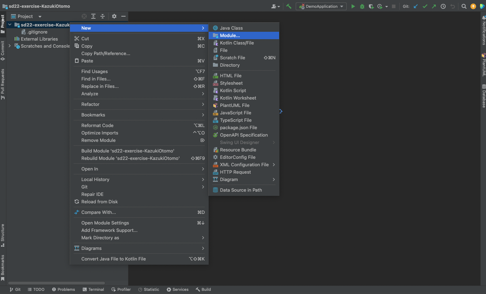
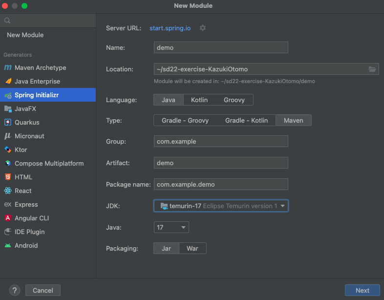
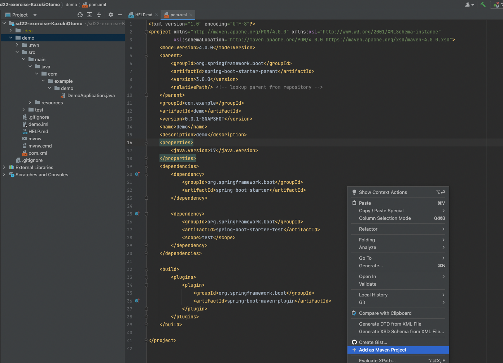
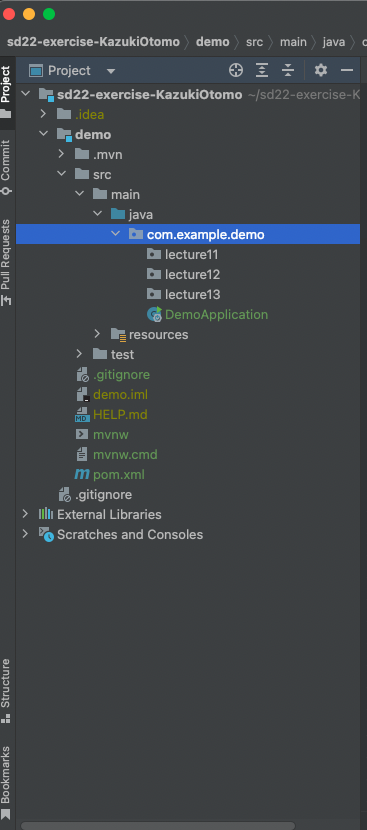
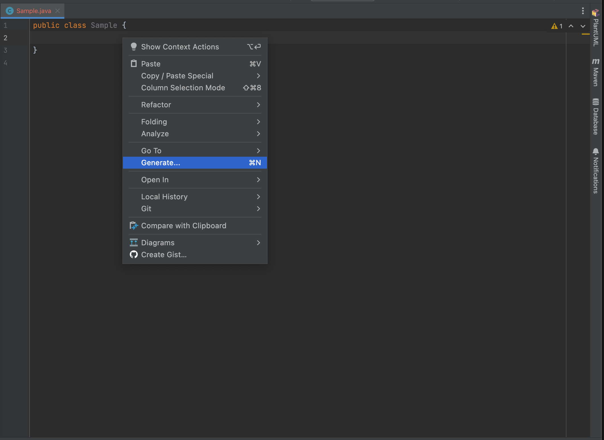
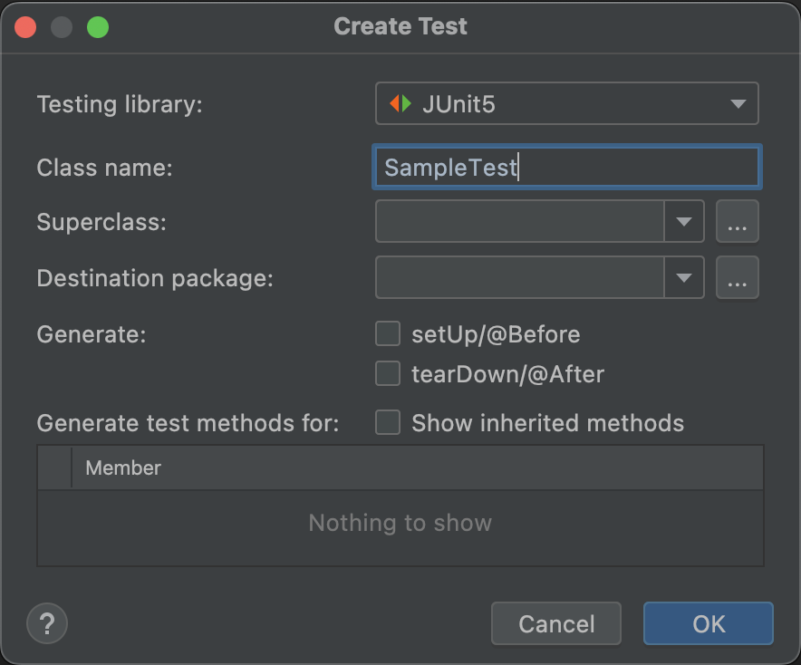
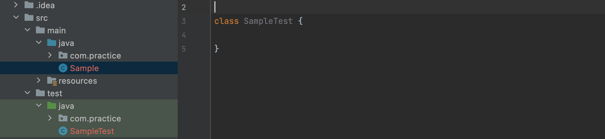
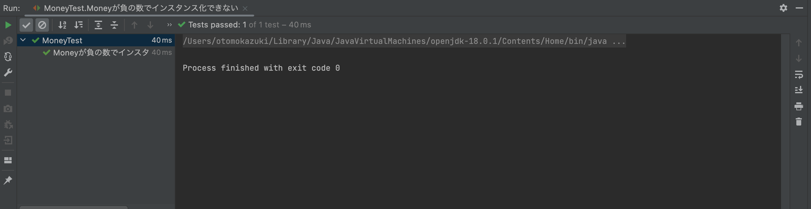

author: Kazuki Otomo
summary: WorkSheet2-1
id: WorkSheet2-1
categories: codelab,markdown
environments: Web
status: Published
feedback link: https://github.com/KazukiOtomo

# ソフトウェアデザイン第2回

## 課題提出用の指示

<aside class="negative">
前回の作成したGithub ClassRoomとは別のレポジトリを用意したので、注意してください。
</aside>

授業の指示にあるGithub ClassRoomのリンクを押して、URLが
sd22-**exercise**-XXXXXXXとなっていることを確認して、cloneしてください


### その上で、Moduleを選択し、


### 以下のような設定でNextを押し、（JavaのVersionについては、17以上であれば問題ありません）次の画面でもCreateを押します。


### pom.xmlを開き、右クリックして「Add as Maven Project」を押すと、 Javaクラスとして認識されると思います。


### 下図のように、com.example.demo内に、lecture11 ~ 13のパッケージを作成してください。


<aside class="negative">
今回の課題は、このlecture11パッケージ内にクラスを作成して提出してください。
</aside>


## アクセス修飾子

|     アクセス修飾子       | 範囲 |
| ---------- | ---- | 
| private　　 | 同一クラス  |  
| public | 制限なし  | 
| protected　 | 同一パッケージ or 継承先のクラス   |  
| package private（デフォルト）| 同一パッケージ  |  

アクセス修飾子を付与すると、変数やメソッドの**可視性**を制御することができる。
**可用性**を気にして何でもpublicにすると、どこからでも触れるようになってしまうので、
**密結合**になりがちなので、privateあるいはpackage privateを利用するのを推奨する。


## 演習１
以下で示すコードには、複数の問題があります。

コードに含まれている問題点を指摘した上で、
改善したクラスを作成してください。（改善箇所や方法は１つとは限りません）

追記事項
・Cardは、トランプのカードです。

Card.java
```java
public class Card {

    public String mark;
    public int number;

    public Card(String mark, int number) {
            this.mark = mark;
            this.number = number;
    }
}
```

Calculator.java
```java
public class Calculator {

    /**
     * 10以上の数字であれば10を返すメソッド
     * @param card　
     * @return 1 ~ 10の整数
     */
    public static int getScore(Card card) {
        if (card.number > 10) card.number = 10;
        return card.number;
    }
}
```


## Stream
配列やListといった**コレクションオブジェクト**の要素に対して処理をかけたい場合、
今まではFor文や拡張For文を扱ってきたと思いますが、
Javaには**Stream**という、値の集合に対する処理を使い回す仕組みがあります。

Streamを使った場合
```java
    var data = new ArrayList<>(Arrays.asList(1, 2, 3, 4, 5));
    var filteredData = data.stream()
                    .filter(e -> e < 3)
                    .collect(Collectors.toList());

    System.out.println(filteredData); // result : [1, 2]
```

For文で書いた場合
```java
    var data = new ArrayList<>(Arrays.asList(1, 2, 3, 4, 5));
    var filteredList = new ArrayList<>();

    for (var element : data) {
        if (element < 3) filteredList.add(element);
    }

    System.out.println(filteredList); // result : [1, 2]
```

Streamを使う大きなメリットとしては、可読性の向上が挙げられる。

・Streamの場合

    filter()を呼び出して、要素を抽出し、リストに変換して返している
    データの集合に対して、「フィルタをかけてくれ」といった宣言をしているだけ

・For文の場合

    別のリストを作り、条件に引っかかった要素を別のリストにadd()している
    「実現するための操作方法」を実装している

「宣言的」な書き方をすると、細かい実装を隠蔽することができ、
コードから**何がしたいのかという意図**が理解しやすくできます。


## 演習２

以下に示すコードを読み取り、
SampleService.java内のsampleMethodの処理を完成させよ。
(Main.javaは実行用のクラスです)

Dog.java
```java
public class Dog {

    private final String name;
    private final int age;

    public Dog(String name, int age) {
        this.name = name;
        this.age = age;
    }
}
```

Dogs.java
```java
public class Dogs {

    private List<Dog> dogs;

    public Dogs() {
        this.dogs = new ArrayList<>();
    }

    // リストオブジェクトを変更不可の状態で返す
    public List<Dog> getDogs() {
        return Collections.unmodifiableList(dogs);
    }

    public void addNewDog(Dog dog) {
        this.dogs.add(dog);
    }
}
```

ISampleService.java
```java
public interface ISampleService {

    /**
     * 第１引数dogsに、第２引数dogを追加する
     *
     * @param dogs
     * @param dog
     */
    void addDog(Dogs dogs, Dog dog);

    /**
     * このメソッドでは、Dogsに含まれるnameの総文字数を取得したい
     *
     * @param dogs
     * @return Dogs内のnameの総文字数
     */
    int sampleMethod(Dogs dogs);
}
```

SampleService.java
```java
public class SampleService implements ISampleService {

    private final Dogs dogs = new Dogs();

    @Override
    public void addDog(Dogs dogs, Dog dog) {
        dogs.addNewDog(dog);
    }

    @Override
    public int sampleMethod(Dogs dogs) {
        /**
         * 以下、処理部分
         */
    }
}
```

Main.java
```java
public class Main {

    public static void main(String[] args) {

        var sampleService = new SampleService();
        var dogs = new Dogs();

        sampleService.addDog(dogs, new Dog("poti", 5));
        sampleService.addDog(dogs, new Dog("wanwan", 8));

        var counter = sampleService.sampleMethod(dogs);
        System.out.println("総文字数は" + counter);
        // 出力：10
    }
}
```

## Enumと区分オブジェクト

Enumは列挙型とも呼ばれ、区分定数の一覧を宣言する用途でよく使われています。
```java
public enum Country {
    America,
    China,
    Japan,
    Germany,
    TheUnitedKingdom,
}

```

列挙型は、Java以外の言語でもよく用意されていますが、
Javaでは列挙型もクラスとして扱われます。
なので、

    区分ごとの値をインスタンス変数に保持する
    区分ごとに異なるロジックをメソッドとして記述することができる

といった使い方ができます。この手法を**区分オブジェクト**と呼びます。

やり方としては、

Country.java
```java
public enum Country {

    /**
    * ()でコンストラクタに引数を渡す
    */
    America(1, "アメリカ"),
    China(86, "中国"),
    Japan(81, "日本"),
    Germany(49, "ドイツ"),
    TheUnitedKingdom(44, "イギリス"),

    ;　　　// セミコロンで要素とクラス定義を区切る
    
    private int code; // カントリーコード
    private String japaneseName; // 日本語名

    /**
    * コンストラクタ
    * かならずprivate指定でなければならない
    */
    private Country (int code, String japaneseName) {
        this.code = code;
        this.japaneseName = japaneseName;
    }

    public int getCode(){
        return code;
    }

    public String getJapaneseName(){
        return japaneseName;
    }
}
```

1つ注意しないといけないのが、
enumのコンストラクタは必ずprivate指定でないと行けない点で、
private以外を指定した場合はコンパイルエラーとなる。
これはenumの要素が新規生成されるのを防ぐためである。

Country.javaを使う側のコード
```java
Country c = Country.China;
int code = c.getCode();
String japaneseName = c.getJapaneseName();
```

このように、区分ごとに異なる処理（業務ロジック）を、区分ごとに別のクラスに独立させると、
オブジェクト指向らしいコードの整理ができます。
つまり、どこに何が書いてあるかがわかりやすくなるとともに、
新しく機能追加する際に、**どこに書くべきなのか**がわかりやすくなります。

また、区分オブジェクトを活用することによって、
switch文やif文を使った条件分岐を減らすことも可能です。


## テストの作り方

プログラムのテストでは、用意した入力に対して期待通りの出力が得られるか確認をします。
この確認を行うためのプログラムを書くために、Javaでは標準的にJUnitを使います。

### JUnitのセットアップと実行

テストを作成したいクラスを開いている状態で、
**Generate**（または、Alt + Insert  or  Command + N）を押して、
**Test...**　を選択する。



以下のようなポップアップが出るので、OKを押す。



これで、src/test下にテストクラスを作ることができます。
（作成される場所は、mainパッケージと同様の配置になります。）




### テストケースの実装

テストクラス内に次の行を加えてテストメソッドを実装します。

```java
@Test
void テストケースのサンプル() {
    assertEquals(6, 4 + 2);
}
```

assertEqualsは、**アサーションメソッド**と呼ばれるメソッドであり、
実行結果が期待した値になっているか確認・検証するためのメソッドです。

第１引数に期待する値を、第２引数に実際の値（クラスやメソッドで検証したい値）を入れます。

他のアサーションメソッドを使って、自分の書いたプログラムが
意図した通りに動作しているか確認・検証することがテストを作る目的の１つです。


## テスト駆動開発

テスト駆動開発（TDD）とは、実装よりも先にテストを書くという手法のことです。
実装前にテストを書くことで、オブジェクトの使われ方（振る舞い）をあらかじめ定めておくなど、
具体的な実装とは切り離した視点でクラスやメソッドについて考えることができます。

例えば、あるアプリケーションにおいて、「Moneyは負の数にはならず、100万を超えることもない」
ということが業務の中でわかっていたとします。
ここで、Money用のテストクラス（MoneyTest.java）を作成し、その中に以下のようなテストケース
を実装します。

MoneyTest.java
```java
class MoneyTest {

    @Test
    void Moneyが負の数でインスタンス化できない() {
        assertThrows(IllegalArgumentException.class,
                () -> new Money(-1));
    }
}
```

次に、テストケースを満たすようなMoneyクラスを実装します。

```java
public class Money {

    private final int amount;

    public Money(int amount) {
        if (amount < 0 || amount > 1000000) throw new IllegalArgumentException();
        this.amount = amount;
    }
}
```

ここで、テストケースを実行すると成功していることが確認できると思います。



ここで気づいて欲しいことは、このMoneyクラスを使うところに、**Moneyに関する異常値チェックが必要なくなる**
という点です。なぜなら、Moneyは異常な値でインスタンス化されず、final（イミュータブル）にしているので、
異常な値を持っていることが絶対にないようにクラスを設計したからです。

防御的プログラミング的な思考では、「相手のクラスが何をするか分からない」という体で、
お互いに異常な値が入ってこないか、その都度チェックするようなコードを書きます。
しかし、これでは特定のクラスを使っている箇所にて重複したコードが書かれ、
ルールに変更が生じた場合に、修正箇所が膨大になってしまいます。

このように、オブジェクトだけではなく、アプリケーションサービス（XxxService.java）における
オブジェクトの使われ方をあらかじめ定めることができるので、
初期の設計や集団開発において、役に立てることもできます。

## 演習3

以下のテストを満たすような、Human.javaを書いてください。

StudentTest.java
```java
class HumanTest {

    @Test
    void HumanのhumanIdが0以下の時はインスタンス化できない() {
        assertThrows(IllegalArgumentException.class,
                () -> new Human(-1, "ChitoseTarou", Age.ADULT));
    }

    @Test
    void HumanのhumanNameがnullの時はインスタンス化できない() {
        assertThrows(NullPointerException.class,
                () -> new Human(10, null, Age.CHILD));
    }

    @Test
    void HumanのAgeを変化させることができる() {
        var human = new Human(1, "Titose Hikari", Age.CHILD);
        human.grow();
        assertEquals(Age.ADULT, human.getAge());
    }
}
```


## Giuhub ClassRoomへのPush

### commit コマンド

```
git add.
git commit -m "10回目の課題ファイルを追加"
git push
```
課題が、自分のGithub ClassRoomに提出されます。

自分のGithub ClassRoomをもう一度ブラウザで開き、課題のファイルが提出（push）されていることを確認する。

ここまで終われば完了です。お疲れ様でした。