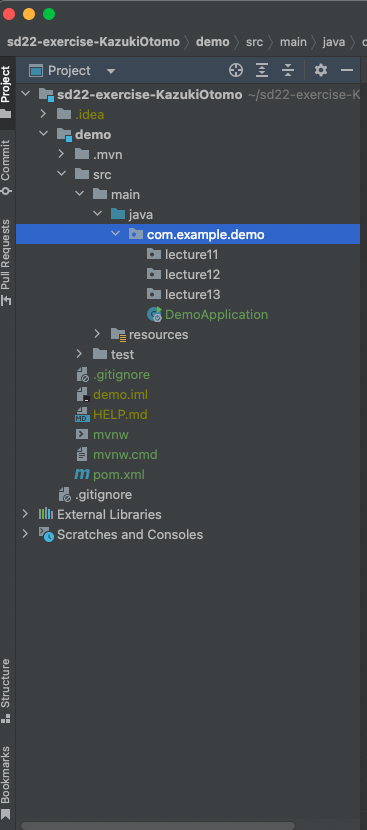

author: Kazuki Otomo
summary: WorkSheet3-1
id: WorkSheet3-1
categories: codelab,markdown
environments: Web
status: Published
feedback link: https://github.com/KazukiOtomo

# ソフトウェアデザイン第3回


## 課題提出用の指示

<aside class="negative">
前回使ったGithub ClassRoomと同じレポジトリで提出してもらいます。注意してください。
</aside>

（変更していなければ）フォルダ名がsd22-**exercise**-XXXXXXXとなっていることを確認してください。

<aside class="negative">
今回の課題は、このlecture12パッケージ内にクラスやパッケージを作成して提出してください。
</aside>




## 値オブジェクト

```java
int quantity;
BigDecimal amount;
```

このコードは、数量（quantity）をマイナス21億からプラス21億まで、
金額（amount）をほぼ無限大かつ小数点21億桁まで扱うような宣言になっています。

しかし、業務内で扱う数量や金額においてそのような値が登場することはありません。
もちろん、文法的には問題ありませんが、異常な値（バグ）が混入する可能性が高くなります。

この問題を防ぐために用いるデザインパターンが、**値オブジェクト**です。

値オブジェクトを実装したコードは以下のようになります。

注目してほしい点は、

    ・デフォルトコンストラクタ（引数なしコンストラクタ）が生成できない
    ・Setterが利用できない
    ・Getterは利用できる
    ・継承が利用できない

Amount.java 
```java
public class Amount {
    private final long value;

    public Amount(final long value) {
        this.value = value;
    }

    public long getValue() {
        return this.value;
    }

// オブジェクトの参照を行うために必要な実装
    @Override
    public boolean equals(final Object o) {
        if (o == this) return true;
        if (!(o instanceof Amount)) return false;
        final Amount other = (Amount) o;
        if (this.getValue() != other.getValue()) return false;
        final Object this$name = this.getName();
        final Object other$name = other.getName();
        if (this$name == null ? other$name != null : !this$name.equals(other$name)) return false;
        return true;
    }

    @Override
    public int hashCode() {
        final int PRIME = 59;
        int result = 1;
        final long $id = this.getValue();
        result = result * PRIME + (int) ($id >>> 32 ^ $id);
        final Object $name = this.getName();
        result = result * PRIME + ($name == null ? 43 : $name.hashCode());
        return result;
    }

    @Override
    public String toString() {
        return "Amount(id=" + this.getValue() + ", name=" + this.getName() + ")";
    }
}
```

ただ、毎回このような実装をするのはコストがかかりすぎるので、簡単に値オブジェクトを作成するライブラリがあるので、今回はそちらを利用します。

## Lombok

Lombokというライブラリを使うと値オブジェクトを実装するのに必要な各メソッドを自動的に生成してくれます。

Amount.java **（Lombokを使用した版）**
```java
import lombok.Value;

@Value
public class Amount {
    long value;
}
```

例えば、このAmountクラスのインスタンスは、getValue()が使えるようになっていたり、serValue()が使えないようなコードが自動的に生成されています。


値オブジェクトを活用したクラスの例と用意できるテストを以下に示します。

Merchandise.java
```java
public class Merchandise {

    private final Amount amount;

    public Merchandise(Amount amount) {
        if (amount.getValue() < 0) throw new IllegalArgumentException("負の値が入っています");
        this.amount = amount;
    }
}
```

MerchandiseTest.java
```java
import org.junit.jupiter.api.Test;

import static org.junit.jupiter.api.Assertions.assertThrows;

class MerchandiseTest {

    @Test
    void 金額がマイナスの商品はインスタンス化することができない() {
        assertThrows(IllegalArgumentException.class,
                () -> new Merchandise(new Amount(-1)));
    }
}
```

このテストでは、商品（Merchandise）クラスが異常な値を持つことが絶対にないという検証になっていると共に、「金額がマイナスになることはない」という**業務におけるルール**も読み取ることができる。
また、独自型を設定することにより、値の渡し間違いを防ぐことができるという利点もある。（例えば、ここでAmountをint型にしていた場合、数量やIDなどといった別の値を間違って渡してしまう恐れがある）


## Lombokの導入

### pom.xmlの編集

pom.xmlを開き、`<dependencies>`のタグ内に、
以下に示すものを追加して、mavenをリロードしてください

pom.xmlに追加するもの（コピペ推奨）
```xml
<dependency>
    <groupId>org.projectlombok</groupId>
    <artifactId>lombok</artifactId>
    <optional>true</optional>
</dependency>
```

参考画像


### 動作確認
「@V」と打って、以下のような予測変換が出ていれば導入に成功しています。


## 演習1

以下のクラス図を読み取った上で実装してください。（なお、作成するクラスは、lecture12パッケージの中に、Problem1パッケージを作ってまとめて下さい。）

メソッドやコンストラクタなど、必要だと思ったものについては随時追加して構いません。


## 演習2
　
PurchaseServiceのselect()とbuy()について、
動作を検証できるようなテストを書いてください。

以下、ヒントです。

PurchaseTest.java
```java
public class PurchaseTest {

    final Stock stock;
    final IPurchaseService purchaseService;

    public PurchaseTest(Stock stock, IPurchaseService purchaseService) {
        this.stock = stock;
        this.purchaseService = purchaseService;
    }

    // 全てのテストケースよりも一番先に走るメソッドです
    @BeforeEach
    void setUp() {
        var merchandise = new Merchandise(new MerchandiseId(101L), new Price(500));
        var merchandise1 = new Merchandise(new MerchandiseId(102L), new Price(1000));

        stock.add(merchandise);
        stock.add(merchandise1);
    }

    @Test
    void buyメソッドが動作している() {
        // 以下、動作しているか確かめるようなテスト
    }

    @Test
    void selectメソッドが動作している() {
        // 以下、動作しているか確かめるようなテスト
    }
}
```

テストの作り方については、[前回の該当部分](https://kazukiotomo.github.io/Claat/WorkSheet2-1/#6)


## ファーストクラスコレクションパターン

コレクションオブジェクト（List, Set, Map, 配列など）を扱うコードは複雑になりがちです。

例えば、

    ・Listに要素を追加する
    ・Listの0番目を抽出する

といった**副作用**のある処理を複数箇所にわたって書いてしまった場合、
バグの原因となると共に、変更する際のチェック範囲を増加させ、
変更容易性の低いコードとなってしまいます。

*コレクションの参照をそのまま渡したGetterメソッド（よくない例）*
```java
public class Cards {
    private final List<Card> cards;

    // このメソッドを呼び出した先で判断/加工/計算が行われる可能性がある
    public List<Card> getList() {
        return this.cards;
    }
}
```

この問題を解決するためのデザインパターンが、
**ファーストクラスコレクション**パターンです。

これは、コレクション型のインスタンス変数を１つだけ持つ専用クラスを作り、
コレクションに関するロジックをカプセル化することで、
コレクションを操作するロジックをコレクションオブジェクトに閉じ込めることを目指しています。

*サンプルコード（ファーストクラスコレクション）*
```Java
public class Cards {
    private final List<Card> cards;

    public Cards(){
        this.cards = new ArrayList<Card>();
    }

    // コレクションを操作するロジックをクラス内に閉じ込める
    void add(Card card) { ... }
    void removeIfExist(Card card) { ... }

    int count() { ... }
}
```

また、コレクションオブジェクトは、業務の関心事そのものであることが多いです。

例えば、同じCardインスタンスを持つコレクションオブジェクトでも、
「デッキ」と「手札」では、ルールや振る舞いは異なるものであるはずです。

なので、それぞれ専用のクラスを作り、それぞれに対応した専用のクラスを用意することで
業務ロジックをわかりやすく整理し、コードの変更を楽で安全にすることにつながります。


## 演習3

演習1で作成したクラスについて、
ファーストクラスコレクションパターンで書き換えてみましょう。
(書き換えたクラス群については、lecture12 > Problem2にまとめておいてください)

## Enumと区分オブジェクト

Enumは列挙型とも呼ばれ、区分定数の一覧を宣言する用途でよく使われています。
```java
public enum Country {
    America,
    China,
    Japan,
    Germany,
    TheUnitedKingdom,
}

```

列挙型は、Java以外の言語でもよく用意されていますが、
Javaでは列挙型もクラスとして扱われます。
なので、

    区分ごとの値をインスタンス変数に保持する
    区分ごとに異なるロジックをメソッドとして記述することができる

といった使い方ができます。この手法を**区分オブジェクト**と呼びます。

やり方としては、

Country.java
```java
public enum Country {

    /**
    * ()でコンストラクタに引数を渡す
    */
    America(1, "アメリカ"),
    China(86, "中国"),
    Japan(81, "日本"),
    Germany(49, "ドイツ"),
    TheUnitedKingdom(44, "イギリス"),

    ;　　　// セミコロンで要素とクラス定義を区切る
    
    private int code; // カントリーコード
    private String japaneseName; // 日本語名

    /**
    * コンストラクタ
    * かならずprivate指定でなければならない
    */
    private Country (int code, String japaneseName) {
        this.code = code;
        this.japaneseName = japaneseName;
    }

    public int getCode(){
        return code;
    }

    public String getJapaneseName(){
        return japaneseName;
    }
}
```

1つ注意しないといけないのが、
enumのコンストラクタは必ずprivate指定でないと行けない点で、
private以外を指定した場合はコンパイルエラーとなる。
これはenumの要素が新規生成されるのを防ぐためである。

Country.javaを使う側のコード
```java
Country c = Country.China;
int code = c.getCode();
String japaneseName = c.getJapaneseName();
```

このように、区分ごとに異なる処理（業務ロジック）を、区分ごとに別のクラスに独立させると、
オブジェクト指向らしいコードの整理ができます。
つまり、どこに何が書いてあるかがわかりやすくなるとともに、
新しく機能追加する際に、**どこに書くべきなのか**がわかりやすくなります。


## 今日の知識を活用するとどうなるのか

### 良くない例

Card.java
```java
class Card{

     final String number;
     final String mark;
     // このように、フィールド名だけで区別しようとすると、例えばインスタンス化の時に謝って逆順に挿入する可能性がある。

     public Card (String number, String mark) {
        this.number = number;
        this.mark = mark;
     }

     public String getContent(){
        return "符号は" + this.mark + "数字は" + this.number;
     }
}
```

実行クラス
```java
class main{
    public static void main(String[] args) {
        // 下記の二つともコンパイルには成功するが...
        var card = new Card("1", "ハート");
        var card1 = new Card("スペード", "6");

        card.getContent();
        // ここで、符号と数字が逆転したバグが生じてしまう（符号と数字の表示が逆になる　例：「符号は6 数字はスペード」）
        card1.getContent();
    }
}
```

### 改善例

Card.java
```java
public class Card {

    // 値を扱うための独自クラスを作成する（値オブジェクト）
    final Number number;
    // 区分を表現するEnum
    final Mark mark;

    public Card(Number number, Mark mark) {
        // 不正なインスタンス化を防御するガード節
        if (number.getValue() < 0 || number.getValue() > 13) throw new IllegalArgumentException("不正な数字のCardは作れない");
        this.number = number;
        this.mark = mark;
    }

    public String getContent() {
        return this.mark.name + "," + this.number.getValue();
    }

}
```

Number.java
```java
@Value
public class Number {
    int value;
}
```

Mark.java
```java
public enum Mark {
    スペード,
    クローバー,
    ダイヤ,
    ハート
}
```

実行用クラス
```java
public class main {
    public static void main(String[] args) {

        var card = new Card(new Number(1), Mark.クローバー);

        // 独自型を設定することで、変数を逆順に入れられる可能性がなくなる
        var card1 = new Card(Mark.スペード, new Number(6));

        card.getContent();
        card1.getContent();
    }
}
```

### 結論
値オブジェクト、区分オブジェクト、ファーストクラスコレクションのいずれもやろうとしていることは一緒で、「プログラムが不正な動作をしないように、適切な型定義を行うことで防御すること」です。これを**型安全性**と言います。

良くない例のように、フィールド名で区別することも可能ですし、値オブジェクトを使うとクラスの数が余計に増えていくと感じるかもしれませんが、型安全性を確保できるメリットは想像以上に大きいです。