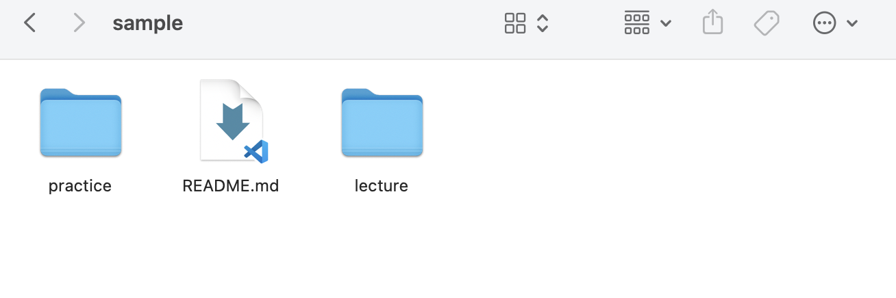
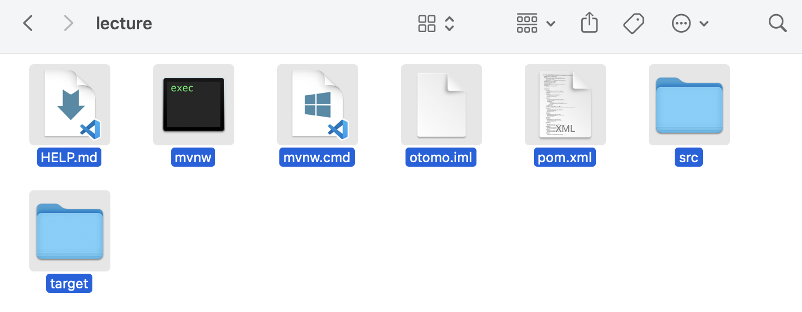

author: Kazuki Otomo
summary: WorkSheet5-1
id: WorkSheet5-1
categories: codelab,markdown
environments: Web
status: Published
feedback link: https://github.com/KazukiOtomo

# ソフトウェアデザイン第14回

## 課題提出用の指示

<aside class="negative">
ポストテスト用のGithub ClassRoomのレポジトリで提出してもらいます。注意してください。

https://classroom.github.com/a/E1Iwn_1z
</aside>

## ポストテスト用の準備
以下のコマンドを打って、配布用のレポジトリをcloneしてください。
（場所は自分のわかる場所であれば、どこでも大丈夫です。）

```
git clone https://github.com/KazukiOtomo/sample.git
```

cloneしたsampleパッケージの構成は、以下の画像のようになっています。


この**lectureパッケージの中身**をGithub Classroomからcloneした自分のレポジトリ
（sd22-**post**-XXXXXXX）に貼り付けて、一度pushしてください。



最後に、IntelliJ IDEAから、sd22-**post**-XXXXXXXを開きます。
<aside class="negative">
※注意！　cloneしたlectureパッケージの方で、間違えて作業をしないように気をつけてください！
</aside>

## 仕様について（プレテストと同じものです）
フロント部分についてはLineBotを利用し、データベースも使います。
ゲームのルールについては、ローカルルールなど複数あるようなのでこちらから指定します。
記述されていないルールに関しては、各々の判断に委ねます。
任意でクラス図やビジネスフロー図などの図を使っても構いません。

 - プレーヤーとディーラーは、最初にカードを2枚ずつ引く
 - ディーラーはカードを１枚だけ公開しておく
 - それぞれの初期手札をデータベースに記録しておく（テーブル構造の定義については指定はありません）
 - 10以上のカード（J, Q, K）は、全て「10」として扱う
 - 1（A）については、そのまま「1」として扱う
 - ディーラーは手札が「17」以上になるまでカードを引かなければならない
 - 手札の合計値が「21」に近い方の勝利
 - 手札の合計値が「21」を超えると失格
 - 引き分けの場合はディーラーの勝ちとする（両方失格、手札の合計値が同じの場合はディーラーの勝利）

イメージ画像（表示のメッセージについて指定はありません）


## 追加・変更する仕様について

・ハート/ダイヤのとき、数字を半分にして加算する（端数は切り捨て　例：「ハートの５」→「3」として計算する）

・Aを場合に応じて、「1」「11」として、計算するようにする。

・（配布用コード版）現状、LINE Botで動かした時に、明らかにおかしい挙動をしている。

・追加で引いたカードをDBに記録するようにする